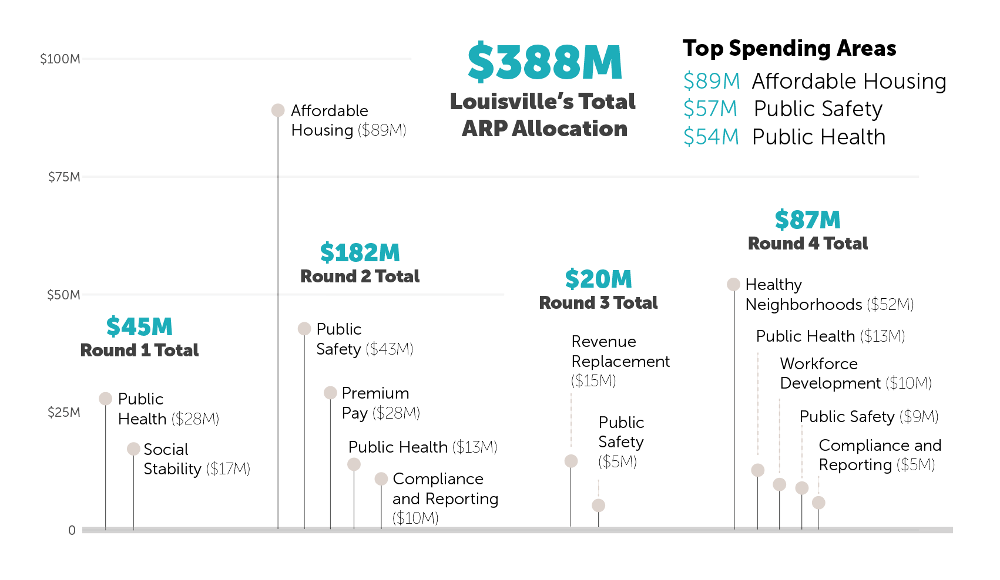
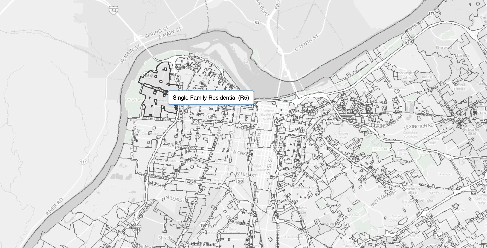
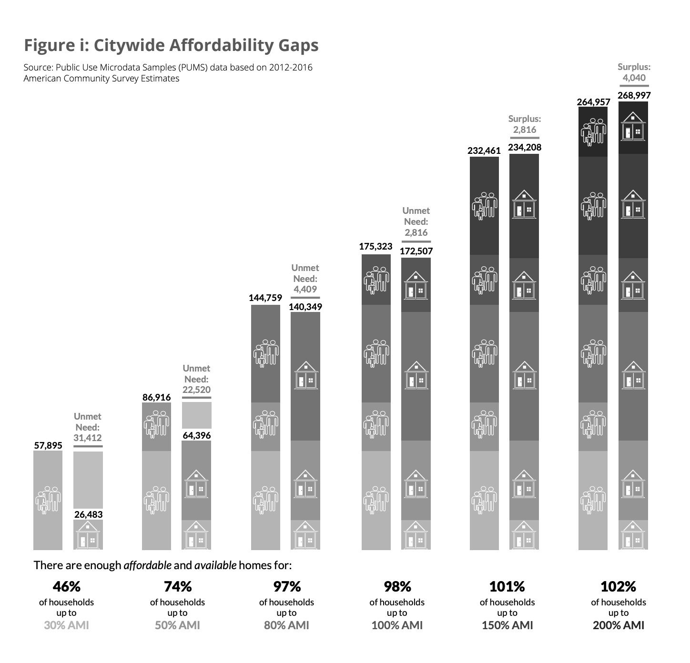

``` {r lollipop plots, fig.show='hide', warning=FALSE}

library(ggplot2)

first_round <- read.csv('intermediate_data/first_round.csv')

first_round_lollipop <- ggplot(first_round, aes(x=x_position, y=allocation)) + 
geom_point(size=3.5, color="#ddd4cf") + 
geom_text(label=first_round$category, nudge_y = 2, size=4) +
geom_segment(aes(x=x_position, 
                      xend=x_position, 
                      y=0, 
                      yend=allocation), size=0.1) + 
geom_hline(yintercept=0, color='dark gray', size=1.5) +
scale_y_continuous(limits=c(0,100)) +
theme_minimal() +
theme(panel.grid.minor.y = element_blank(), panel.grid.major.x = element_blank(), panel.grid.minor.x = element_blank(), axis.title.x=element_blank(), axis.title.y=element_blank(), axis.text.x=element_blank(),axis.ticks.x=element_blank()) 


second_round <- read.csv('intermediate_data/second_round.csv')

second_round_lollipop <- ggplot(second_round, aes(x=x_position, y=allocation)) + 
geom_point(size=3.5, color="#ddd4cf") + 
geom_text(label=second_round$category, nudge_y = 2, size=4) +
geom_segment(aes(x=x_position, 
                      xend=x_position, 
                      y=0, 
                      yend=allocation), size=0.1) + 
geom_hline(yintercept=0, color='dark gray', size=1.5) +
scale_y_continuous(limits=c(0,100)) +
theme_minimal() +
theme(panel.grid.minor.y = element_blank(), panel.grid.major.x = element_blank(), panel.grid.minor.x = element_blank(), axis.title.x=element_blank(), axis.title.y=element_blank(), axis.text.x=element_blank(),axis.ticks.x=element_blank()) 


fourth_round <- read.csv('intermediate_data/fourth_round.csv')

fourth_round_lollipop <- ggplot(fourth_round, aes(x=x_position, y=allocation)) + 
geom_point(size=3.5, color="#ddd4cf") + 
geom_text(label=fourth_round$category, nudge_y = 2, size=4) +
geom_segment(aes(x=x_position, 
                      xend=x_position, 
                      y=0, 
                      yend=allocation), size=0.1) + 
geom_hline(yintercept=0, color='dark gray', size=1.5) +
scale_y_continuous(limits=c(0,100)) +
theme_minimal() +
theme(panel.grid.minor.y = element_blank(), panel.grid.major.x = element_blank(), panel.grid.minor.x = element_blank(), axis.title.x=element_blank(), axis.title.y=element_blank(), axis.text.x=element_blank(),axis.ticks.x=element_blank()) 


unallocated <- read.csv('intermediate_data/unallocated.csv')

unallocated_lollipop <- ggplot(unallocated, aes(x=x_position, y=allocation)) + 
geom_point(size=3.5, color="#ddd4cf") + 
geom_text(label=unallocated$category, nudge_y = 2, size=4) +
geom_segment(aes(x=x_position, 
                      xend=x_position, 
                      y=0, 
                      yend=allocation), size=0.1) + 
geom_hline(yintercept=0, color='dark gray', size=1.5) +
scale_y_continuous(limits=c(0,100)) +
theme_minimal() +
theme(panel.grid.minor.y = element_blank(), panel.grid.major.x = element_blank(), panel.grid.minor.x = element_blank(), axis.title.x=element_blank(), axis.title.y=element_blank(), axis.text.x=element_blank(),axis.ticks.x=element_blank()) 

```



## <span style="color: #00acbb;">Child Care</span>

Reliable access to child care in Louisville is vital to a healthy and inclusive economy. By some estimates, as many as 100,000 women in Kentucky stopped working during the pandemic because of a lack of childcare options. Additionally, according to state data, 9% of Louisville’s licensed child care centers closed between March 2020 and November 2021. 

**ARP Spending Recommendation:** $7.5M to provide childcare and early learning projects to address immediate COVID-19 needs, expand access to childcare and early learning, improve quality and mitigate COVID-19 related developmental delays. (Office of the Mayor)

### GLP Data Story

GLP will explore what, specifically, is included in the $7.5M allocation for child care and *link additional data sources* (see below) to round out the story.

``` {r child care}

childcare_tree <- suppressWarnings(read.csv('intermediate_data/childcare.csv'))

#install.packages("collapsibleTree")
library(collapsibleTree) 

childcare_plot <- collapsibleTree(childcare_tree, 
                     c("category", "topic","description"),
                     root=" ",
                     height = 250,
                     fill = "#00acbb",
                     zoomable=FALSE)

childcare_plot
```

### Additional Data Context {.tabset}

#### New Zoning Regulations
Family child care homes can now operate in all residential areas, under certain conditions. Large child care centers can now operate in certain residential and industrial zones (instead of only commercial ones), under certain conditions. 

**Deliverable:** GLP will visualize the expansion in potential child care access, juxtaposed against certain economic data.

Data Sources: [WFPL](https://wfpl.org/city-aims-to-expand-access-to-child-care-facilities-by-loosening-zoning-restrictions/), [Louisville Open Data](https://data.louisvilleky.gov/dataset/jefferson-county-ky-zoning-0)



#### Proximity to Jobs
Child care is tightly interwoven with labor force participation and other labor force outcomes. Louisville saw a large exodus of women from the labor force as child care options dwindled. 

**Deliverable:** GLP will visualize Louisville's job hot spots and compute the potential distances to child care.

## <span style="color: #00acbb;">Youth Development</span>

A sizable portion of the Healthy Neighborhoods round of ARP spending will go toward youth development. GLP will explore, through various data sources, how Louisville's kids in the 10-24 age range fare. 

**ARP Spending Recommendation:** $8.5M in funding for a three year comprehensive and accessible Youth Development System for Louisville Youth (10-24) to access a variety of services and programs and improve public safety. (Office of Safe & Healthy Neighborhoods)

### GLP Data Story

GLP will explore what, specifically, is included in the $8.5M allocation for youth development and *link additional data sources* (see below) to round out the story.

``` {r youth development}

youth_development_tree <- suppressWarnings(read.csv('intermediate_data/youth_development.csv'))

#install.packages("collapsibleTree")
library(collapsibleTree) 

youth_development_plot <- collapsibleTree(youth_development_tree, 
                     c("category", "topic","description"),
                     root=" ",
                     height = 250,
                     fill = "#00acbb",
                     zoomable=FALSE)

youth_development_plot
```

### Additional Data Context {.tabset}

#### Transition to Adult Life
Tracking what opportunities young people pursue after high school paints an important portrait of how the community's youngest people fare.

**Deliverable:** GLP will analyze and visualize data relating to the post-secondary opportunities that young people pursue (college, technical training, military, work, etc.).

Data Sources: [Jefferson County Public Schools](https://assessment.jefferson.kyschools.us/PublicDatasets/PublicResources.aspx?id=511295)

#### Disconnected Youth
Young people who are not pursuing education, employment or other forms of training are considered disconnected. Disconnected youth are at a higher risk of experiencing homelessness or participating in criminal activity.

**Deliverable:** GLP will update its previously compiled data on disconnected youth (between the ages of 16 and 24) to round out the story.

Data Sources: [Federal Reserve](https://fred.stlouisfed.org/tags/series?t=disconnected+youth)

#### Suicide Rates
Generally, nationwide, rates of suicide and self harm are on the rise among young people. Louisville has seen the same trends. 

**Deliverable:** GLP will analyze the rate of suicide and self harm in Louisville.

Data Sources: The Jefferson County Coroner’s Office maintains this data. The [Kentucky Center for Investigative Reporting](https://kycir.org/2021/10/29/youth-suicides-on-the-rise-in-louisville/) has already obtained this data from the coroner's office through a public information request. GLP should be able to obtain this already-compiled data easily through the same method. 

#### Drug Overdoses

**Deliverable:** Through the same methodology used to determine suicide rates, GLP will request drug-related death data from the Jefferson County Coroner's Office.

## <span style="color: #00acbb;">Libraries</span>

Libraries play an important role in any community, from giving people a place to escape extreme weather to providing reliable internet access and useful personal and career development programs. The Healthy Neighborhoods plan allocates a sizeable chunk of money to Louisville's libraries.

**ARP Spending Recommendations:** \$8M to renovate and expand the Main Louisville Free Public Library. \$5M to open a new library branch in the Fern Creek area. \$800K to renovate and expand the Portland Library. \$800K to renovate and restore services to the Parkland Library. (Louisville Free Public Library)

### GLP Data Story

GLP will visualize these allocations and *link additional data sources* (see below) to round out the story and determine how important libraries are to the community.

``` {r libraries}

libraries_tree <- suppressWarnings(read.csv('intermediate_data/libraries.csv'))

#install.packages("collapsibleTree")
library(collapsibleTree) 

library_plot <- collapsibleTree(libraries_tree, 
                     c("category", "topic","description"),
                     root=" ",
                     height = 250,
                     fill = "#00acbb",
                     zoomable=FALSE)

library_plot
```

### Additional Data Context {.tabset}

#### Libraries and Internet Access
For some, libraries are the only free and safe place to access the internet. 

**Deliverable:** GLP will lean on the data previously analyzed in its Path Forward report and visualize Louisville's libraries juxtaposed against internet access. 

#### Other library data
With more funding allocated for libraries, it is helpful to see what people use their public libraries for.

**Deliverable:** GLP will analyze a number of county-level library statistics (program attendance, internet and technology usage, etc.) that are available from the early 2000s onward.

Data Sources: [Kentucky Departments for Libraries and Archives](https://kdla.ky.gov/librarians/plssd/Pages/LibraryStatistics.aspx)

## <span style="color: #00acbb;">Affordable Housing</span>

Louisville has allocated tens of millions of dollars to reduce the number of people experiencing homelessness.

**ARP Spending Recommendations:** \$40M for an affordable housing trust fund expected to fund between 200 and 250 housing units for people at 30% of the area median income. \$32M to increase the capacity of permanent supportive housing by 200 units. \$1.5M for an outdoor safe space with about 50 tents and other facilities. \$7.5M for renovations to the College Street property (ultimately to replace the outdoor safe space). \$4M to expand an existing downpayment assistance program and help 160 new homeowners. \$4M in funding to an existing home repair program. (Office of Resilience & Community Services; Develop Louisville)

### GLP Data Story

GLP will visualize these allocations for others to clearly understand how Louisville will spend the money. A major theme that emerges from the data is the extreme shortage of housing units across the city.

There is no shortage of data sources in Louisville illustrating this housing gap. (See the [Housing Needs Assessment (HNA)](https://louisvilleky.gov/government/housing/housing-needs-assessment) released periodically by Louisville’s Office of Housing and the Louisville Affordable Housing Trust Fund.

GLP will expand on this data, visualizing the most recent estimates, and *link additional data sources* (see below) to round out the story.

``` {r affordable housing}

housing_tree <- suppressWarnings(read.csv('intermediate_data/affordable_housing.csv'))

#install.packages("collapsibleTree")
library(collapsibleTree) 

housing_plot <- collapsibleTree(housing_tree, 
                     c("category", "topic","description"),
                     root=" ",
                     height = 350,
                     fill = "#00acbb",
                     zoomable=FALSE)

housing_plot
```

### Additional Data Context {.tabset}

#### Rent vs. Income Trends
Are incomes rising proportionately with rents for different segments of the population?

**Deliverable:** GLP will analyze and visualize trends in rent prices and income over time.

#### Affordable Housing Gap
As the [Housing Needs Assessment (HNA)](https://louisvilleky.gov/government/housing/housing-needs-assessment) shows, an urgent housing need exists for those living with the lowest incomes. For example, there are only enough available and affordable homes for 46% of households making 30% of the area median income. Louisville needs some 31,000 housing units for this segment of the population. ARP funds will help to bring the city more housing units but will not address the full need.

**Deliverable:** GLP will creatively visualize this surprising gap across all income levels, bring in the most recent data and visualize trends over time.

Data Sources: [Public Use Microdata Sample (PUMS)](https://www.census.gov/programs-surveys/acs/microdata.html); [Housing and Urban Development](https://www.huduser.gov/portal/datasets/assthsg.html)



#### Profile of Homeowners in Subsidized Housing
In addition to knowing how many affordable housing units are needed across Louisville, it's also important to  understand more about the homeowners. 

**Deliverable:** GLP will analyze and visualize the detailed "Picture of Subsidized Households" data from the U.S. Department of Housing and Urban Development to gain a clearer understanding of the gender, age, race, disability status, income source and family structure of households that depend on various subsidized housing programs.

Data Sources: [Housing and Urban Development](https://www.huduser.gov/portal/datasets/assthsg.html)

#### Wait Times for Housing Assistance
Long wait times for federal housing assistance have beleaguered communities and homeowners across the country. 

**Deliverable:** GLP will analyze the current local wait times for housing assistance and the trends over time.

Data Sources: [Housing and Urban Development](https://www.huduser.gov/portal/datasets/assthsg.html)

#### Homelessness Statistics
Who are those individuals in Louisville currently experiencing homelessness and how has that changed over time?

**Deliverable:** GLP will aggregate and visualize homelessness data from the Coalition for the Homeless.

Data Sources: [Annual Census of the Homeless in Metro Louisville](https://louhomeless.org/publications/)

#### Youth Homelessness
**Deliverable:** GLP will aggregate and visualize youth homelessness data from JCPS.

Data Sources: JCPS

Note: This will provide a broader definition of homelessness than just street homelessness. It includes people who are currently sheltered but without a certain home. Many are staying with another family or with a relative while their parents are unsheltered.

#### Housing Permits vs. New Jobs
In many cities across the country, there are more jobs available than there are housing permits being issued.

**Deliverable:** GLP will juxtapose data about the number of new housing permits issued in the last year from the U.S. Census Bureau’s Building Permits Survey with data from the Bureau of Labor Statistics about new jobs being created in a given year. 

Data Sources: [Building Permits Survey](https://www.census.gov/construction/bps/msamonthly.html); [Metro Area Employment](https://www.bls.gov/web/metro/metro_oty_change.htm)

## <span style="color: #00acbb;">Public Safety</span>

Louisville has allocated tens of millions of dollars to public safety and violence deterrence and prevention.

**ARP Spending Recommendation:** \$17.5M for various public safety reforms from the Hilliard Heintz report. \$8M for the Community Violence Intervention Program. \$6M for new LMPD equipment and expanded storage capacity. \$4.5M for Trauma Resilient Communities Expansion. \$3M for a new juvenile assessment center. \$1.3M for Restorative Justice Expansion. \$1M for the Ambassador Institute Expansion. \$1M for the Coordinated Crisis Response to Gun Violence. \$200K for  Family Recovery Courts. \$117K for an Everytown USA Data Fellow. (Louisville Metro Police Department; Office for Safe & Healthy Neighborhoods; Youth Transitional Services)

### GLP Data Story

GLP will visualize and expand on these allocations and link other data sources to round out the story.

``` {r public safety}

public_safety_tree <- suppressWarnings(read.csv('intermediate_data/public_safety.csv'))

#install.packages("collapsibleTree")
library(collapsibleTree) 

public_safety_plot <- collapsibleTree(public_safety_tree, 
                     c("category", "topic","description"),
                     root=" ",
                     height = 250,
                     fill = "#00acbb",
                     zoomable=FALSE)

public_safety_plot
```

### Additional Data Context {.tabset}

#### Kids Entering Detention Centers
Some kids and teens who are awaiting sentencing are required to stay at youth detention centers where they receive education and medical care. In the second round of funding, there is $3M for a Juvenile Assessment Center to "receive and assess youth who have
been detained pre-custody in coordination with the court designated workers
assessment process." 

**Deliverable:** GLP will analyze the number of kids who stay at detention centers (by race and gender) and how long they stay there.

Data Sources: [Louisville Open Data](https://data.louisvilleky.gov/dataset/youth-detention-services); Data only available 2017-2019.

#### Breakdown of Public Safety Spending
How does Louisville's spending on equipment, personnel and programs within its police department compare to overall spending in other departments across the city and spending in other cities?  

**Deliverable:** GLP will analyze broad buckets of spending within the police department and compare it to other cities.

Data Sources: [Louisville Budget](https://louisvilleky.gov/government/management-budget/fy22-budget)

#### Police Officer and Related Staff Salaries

**Deliverable:** GLP will analyze how Louisville compensates its officers (both through salary and benefits) — and how that compares to its peer cities.

Data Sources: [LMPD](https://www.louisville-police.org/278/Salaries)

#### Professional Standards Unit Investigations

**Deliverable:** GLP will analyze and visualize the overall number of investigations launched into police officers, the results of the investigations and the trends over time.

Data Sources: [LMPD Transparency Reports](https://louisville-police.org/800/Transparency-Reports)

## <span style="color: #00acbb;">Public Health</span>

Much of Louisville's initial round of ARP funds went toward immediate public health needs as the city responded to the COVID-19 pandemic.

**ARP Spending Recommendation:** \$15M in reimbursement for eligible COVID-related public health expenditures. \$9.8M for the city's COVID-19 response & vaccination activities. \$1.5M for PPE supplies and equipment to 400 licensed and certified childcare providers. \$400K for suicide prevention. \$1.2M for targeted naloxone distribution, supportive services for syringe service participants and increased access to medication assisted
treatment. 

### GLP Data Story

GLP will visualize these public health expenditures and  *link additional data sources* to expand on certain elements of the plan.

``` {r public health}

public_health_tree <- suppressWarnings(read.csv('intermediate_data/public_health.csv'))

#install.packages("collapsibleTree")
library(collapsibleTree) 

public_health_plot <- collapsibleTree(public_health_tree, 
                     c("category", "topic","description"),
                     root=" ",
                     height = 250,
                     fill = "#00acbb",
                     zoomable=FALSE)

public_health_plot
```

### Additional Data Context {.tabset}

#### Harm Reduction Data
How will Louisville spend its $1.2M investment in targeted naloxone distribution, supportive services for syringe service participants and increased access to medication assisted treatment — and how has access to these services changed over time? 

**Deliverable:** GLP will analyze county-level data over time in Louisville and its peer cities on the following: the number of syringe exchange programs, the number of substance abuse services facilities, the number of Buprenorphine providers, the distance to the nearest syringe services programs and the number of medication assisted treatment centers.

Data Sources: [The Foundation for AIDS Research](https://ehe.amfar.org/data/HIV_plan)


